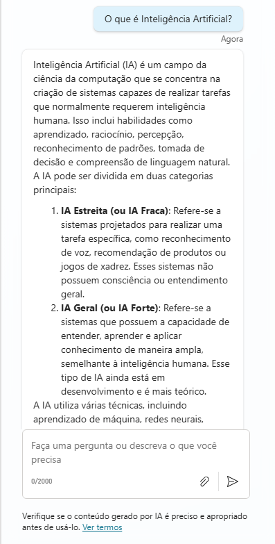
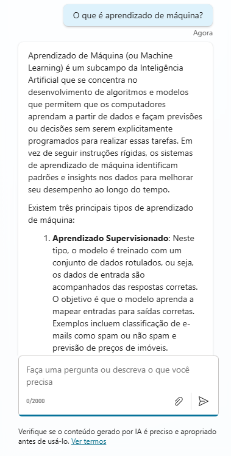

# Assistente de Inteligência Artificial - Microsoft Copilot Studio

## Sobre o Projeto

Este repositório documenta o desenvolvimento do meu primeiro copiloto criado no Microsoft Copilot Studio. O assistente virtual foi projetado para responder dúvidas comuns sobre Inteligência Artificial (IA), incluindo conceitos, tipos, aplicações, aprendizado de máquina, ética e outras questões relevantes da área.

## Objetivo

Criar um copiloto que auxilie usuários a entender melhor o universo da Inteligência Artificial, oferecendo respostas claras e precisas para perguntas frequentes sobre o tema.

## Exemplos de Perguntas e Respostas

- **O que é Inteligência Artificial?**  
  Inteligência Artificial (IA) é um campo da ciência da computação que cria sistemas capazes de realizar tarefas que normalmente requerem inteligência humana, como reconhecimento de voz, tomada de decisão e aprendizado.

- **Quais os tipos de IA existentes?**  
  Existem três tipos principais: IA estreita (focada em tarefas específicas), IA geral (com capacidades humanas amplas) e IA superinteligente (que supera a inteligência humana).

- **O que é aprendizado de máquina?**  
  Aprendizado de máquina é uma subárea da IA que permite que sistemas aprendam e melhorem automaticamente a partir de dados, sem programação explícita.

- **Quais são as aplicações mais comuns da IA?**  
  Reconhecimento facial, assistentes virtuais, diagnósticos médicos, carros autônomos, recomendações de produtos, entre outras.

- **Como a IA impacta a ética?**  
  Levanta questões como privacidade, viés algorítmico, transparência e responsabilidade.

## Documentação Oficial

Para mais informações, consulte a documentação oficial do Microsoft Copilot Studio:  
[https://learn.microsoft.com/pt-br/microsoft-copilot-studio/](https://learn.microsoft.com/pt-br/microsoft-copilot-studio/)

---

## Como usar este repositório

Este repositório tem finalidade documental, apresentando o conceito e o conteúdo configurado no Microsoft Copilot Studio. O copiloto foi criado diretamente na plataforma web da Microsoft e não possui código executável local.

---

## Prints do Copiloto em Ação (Opcional)

Capturas de tela do copiloto funcionando no Microsoft Copilot Studio:

  
  
  

--- 
